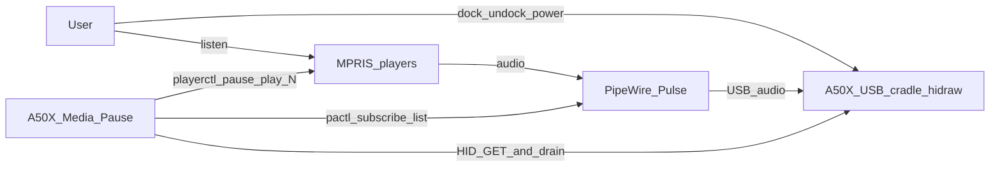
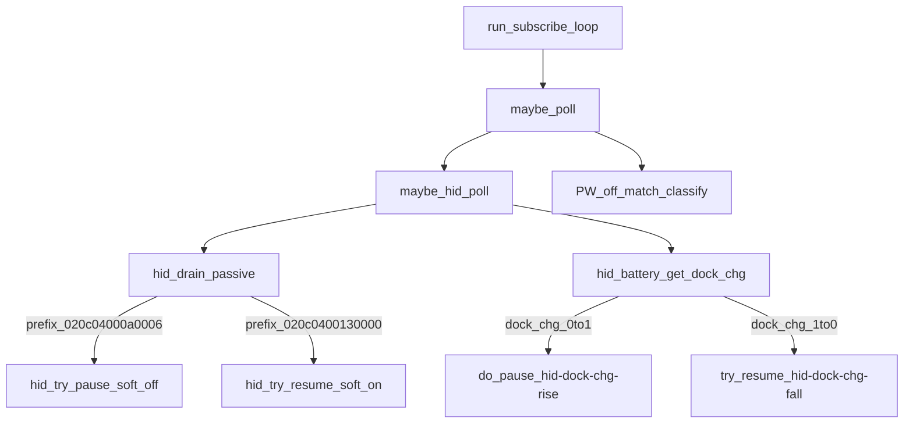

# Astro A50X media pause — architecture (C1–C3)

Operational tree: this repository (`scripts/`, `config/`, `systemd/`, `udev/`).  
HID triggers: [ADR-002](ADR-002-a50x-hid-dock-and-soft-power.md).  
MPRIS control plane: [ADR-003](ADR-003-a50x-multi-mpris-control.md).  
Semantics: [IMPLEMENTATION.md](../IMPLEMENTATION.md).

**Status:** Dock / soft-off / soft-on HID paths shipped (`WATCHER_VERSION=f4-mpris-multi-1`). Default `PLAYER_MODE=single` (Spotify). Human **F4-multi** for `PLAYER_MODE=all` — see [acceptance-matrix](../acceptance-matrix.md). Unit/binary names keep `a50x-spotify-pause`.

## Decisions map

| Concern | SSOT |
|---------|------|
| Dock `dock_chg`, soft-off/on prefixes, GET `06` never soft-on, episode latch | ADR-002 |
| `PLAYER_MODE`, `we_paused_players`, A50 gate matrix, non-MPRIS limits | ADR-003 |
| Deploy paths, SLOs, kill-switch | This C1–C3 + root README |
## C1 — System context



| Actor / system | Role |
|----------------|------|
| User | Docks/undocks headset; soft-disables (power); plays media |
| A50X Media Pause | User systemd watcher — pause/resume MPRIS on confirmed disable/enable (`PLAYER_MODE=single\|all`) |
| MPRIS players | Session bus players via `playerctl` (Spotify default; browsers/VLC when `all`) |
| PipeWire | Sinks / sink-inputs; off-match is secondary / late for soft-disable |
| A50X cradle hidraw | Logitech `046d:0b0b` — battery GET + passive interrupts |

## C2 — Containers (deployables)

```mermaid
flowchart TB
  subgraph userSpace [User_session]
    unit[systemd_user_a50x-spotify-pause]
    bin[a50x-spotify-pause_bash]
    libs[a50x-spotify-pause-lib]
    cfg[config_XDG]
    unit --> bin
    bin --> libs
    bin --> cfg
  end
  subgraph host [Host]
    udev[udev_hidraw_rw]
    hid[/dev/hidrawN]
    udev --> hid
  end
  bin -->|exec9| hid
  bin -->|pactl| pw2[PipeWire]
  bin -->|playerctl| mprisBus[MPRIS_session_bus]
```

| Container | Path / unit |
|-----------|-------------|
| Watcher binary | `~/.local/bin/a50x-spotify-pause` ← topic scripts |
| Watcher libs | `~/.local/bin/a50x-spotify-pause-lib/` (`hid.sh`, `mpris.sh`, classifier) |
| User unit | `~/.config/systemd/user/a50x-spotify-pause.service` |
| Config | `~/.config/astro-a50x-spotify-pause/config` (`PLAYER_MODE`, `PLAYER`, `SINK_MATCH`, …) |
| Udev | `/etc/udev/rules.d/99-logitech-a50x-hid.rules` |

**Structure note (no new ADR):** Variant A file split only — ADR-002 / ADR-003 semantics unchanged.

## C3 — Watcher components (HID + PW)



| Signal | Prefix / edge | Action | Gate |
|--------|---------------|--------|------|
| Soft-off | `020c04000a0006` | `do_pause hid-soft-off` | `on_match_gate` + Playing eligible (`single`: cork OK); sets `hid_soft_off_episode` |
| Soft-on | `020c0400130000` | `try_resume hid-soft-on` | Episode + `we_paused_players` + `AUTO_RESUME` |
| Dock | `dock_chg` 0→1 (GET byte8) | `do_pause hid-dock-chg-rise` | Same play/sink gates |
| Undock | `dock_chg` 1→0 | `try_resume hid-dock-chg-fall` | `we_paused_players` |
| Heartbeat | `cmd=05` | Ignore | — |
| Battery GET reply | `cmd=06` | Dock byte only — **never** soft-on | — |

| Mode | A50 gate | Pause targets |
|------|----------|---------------|
| `single` | `player_on_match_sink` (`PLAYER`) | `$PLAYER` |
| `all` | `any_on_match_sink` | All Playing from `playerctl -l` |

| Script module | Role |
|---------------|------|
| `scripts/a50x-spotify-pause.sh` | Entry: config, PW subscribe/latch, sources libs |
| `scripts/lib/hid.sh` | ADR-002 triggers: battery GET `dock_chg`, soft-off/on |
| `scripts/lib/mpris.sh` | ADR-003 control + shared pause orchestration (Variant A peel; not a pure plane) |
| `scripts/lib/classify-remove-intent.sh` | Pure F0 remove-intent classifier |
| `scripts/tools/*` | Closed research ladder; install with `--with-tools` only |

## Research ladder (closed)

| Gate | Outcome |
|------|---------|
| F2c `online_fall` / F2d GET byte-diff | **FAIL** — soft-disable keeps answering GET |
| F2e passive prefixes | **PASS** — exclusive OFF/ON frames |
| F3 / F4 dock wire | **PASS** |
| F3b / F4b soft-off | **PASS** |
| F3c / F4c soft-on | **PASS** |
| F4-multi (`PLAYER_MODE=all`) | Human matrix — see [acceptance-matrix](../acceptance-matrix.md) |

## Kill-switch

```bash
systemctl --user stop a50x-spotify-pause.service
# or HID_ENABLE=0 / ENABLED=0 / PLAYER_MODE=single in config
```
